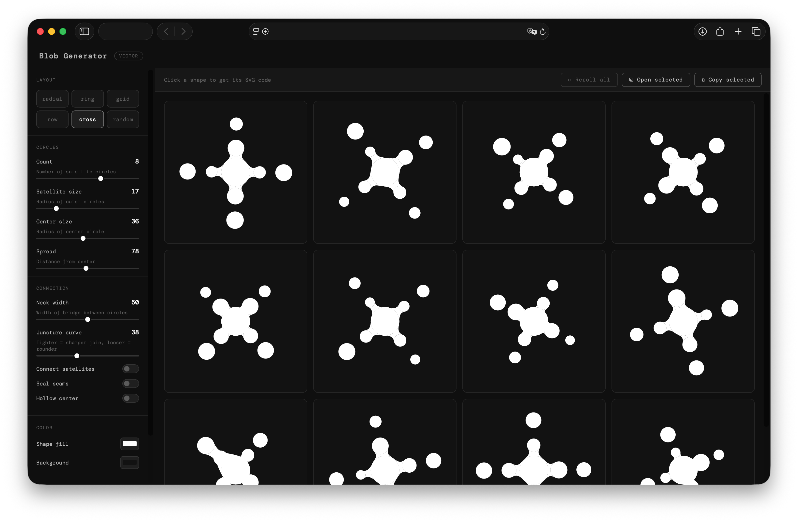

# SVG Blob Generator

A browser-based tool for generating organic blob shapes made of connected circles. No dependencies, no build step — just open the HTML file.

## Features

- **6 layout presets** — radial, ring, grid, row, cross, random
- **Full shape control** — satellite count, sizes, spread, neck width, juncture curve
- **Seal seams** — fuses overlapping shapes into a single silhouette
- **Hollow center** — punches a circular hole through the center
- **Connect satellites** — bridges adjacent outer circles to each other
- **Grid view** — generate up to 24 variations at once, reroll individually or all at once
- **Export** — click any shape to open an SVG preview + copy/download the code, or select multiple shapes with the checkbox and batch download

## Usage

1. Open `index.html`
2. Adjust the controls in the sidebar
3. Click a shape to preview its SVG code
4. Check the box on shapes you want to save, then hit **Download selected**

No server required. All generation happens client-side in plain JavaScript.

## Controls

| Control | Description |
|---|---|
| Count | Number of satellite circles |
| Satellite size | Radius of outer circles |
| Center size | Radius of the central circle |
| Spread | Distance of satellites from center |
| Neck width | Width of the bridge connecting circles (lower = thinner) |
| Juncture curve | Bezier handle length — lower = sharper join, higher = rounder |
| Connect satellites | Bridge adjacent satellites to each other |
| Seal seams | Merge all shapes into one unified silhouette |
| Hollow center | Cut a circular hole through the center |
